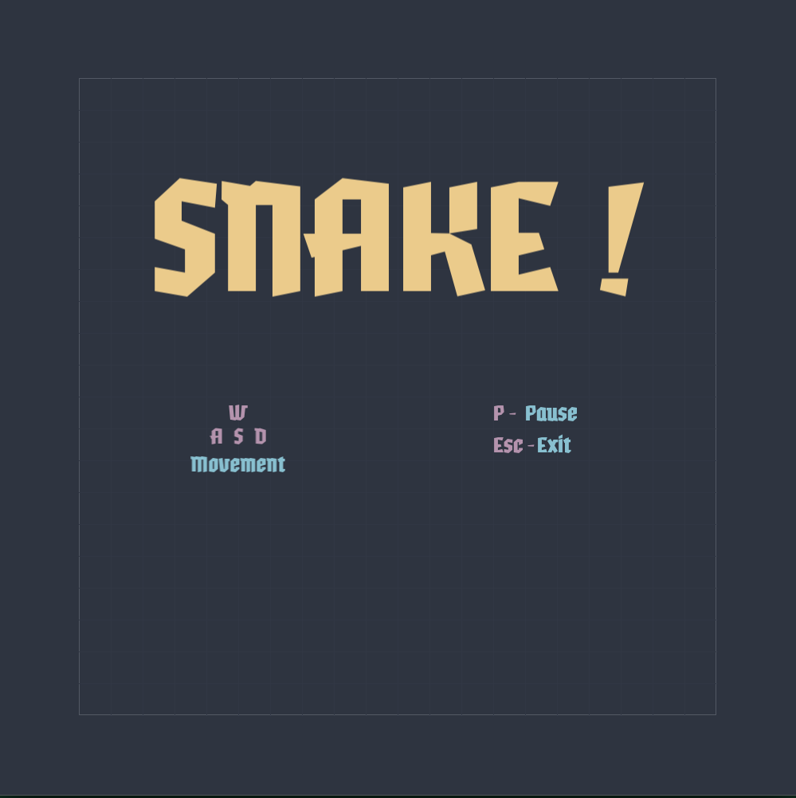
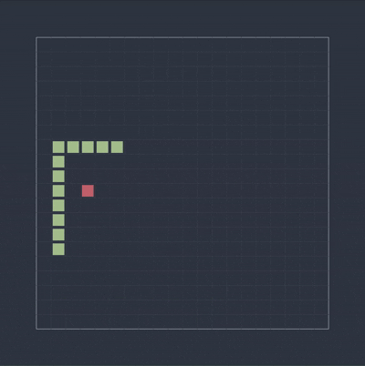
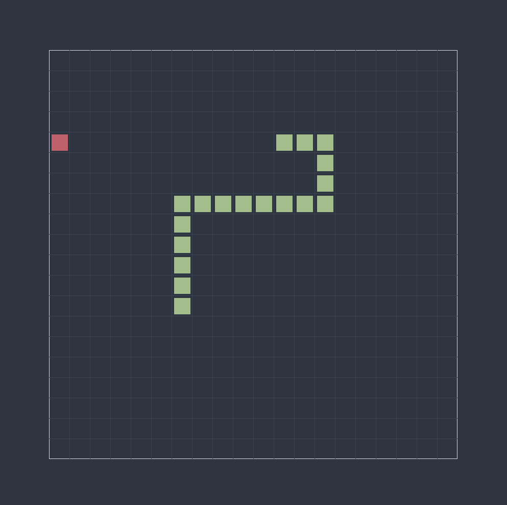
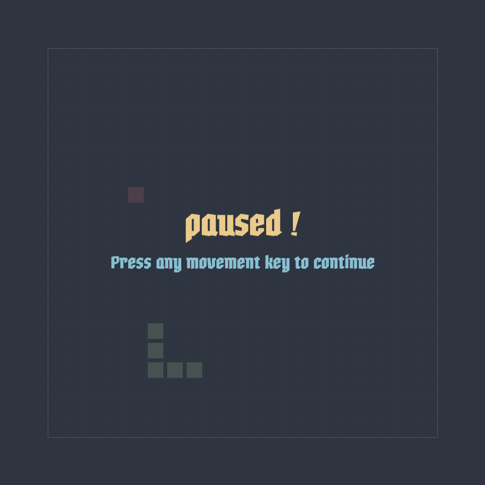

# SNAKE game in C++
SNAKE game clone created in C++ and SDL3, The project is also designed to be compile with emscripten to webasm and be [deployed online](https://arsenic-atg.github.io/Snake/).

| [Start a new game](https://arsenic-atg.github.io/Snake/) |
| --------------------------------------- |


<table>
  <tr>
    <td> </td>
    <td></td>
   </tr> 
   <tr>
      <td></td>
      <td>
  </td>
  </tr>
</table>

## controls

| key                | Action                   |
|--------------------|--------------------------|
| `w`                | move up                  |
| `a`                | move left                |
| `s`                | move down                |
| `d`                | move left                |
| `esc`              | exit window              |

## Dependencies

- [Git](https://git-scm.com): for version control
- [Standard C++ compiler](https://en.wikipedia.org/wiki/List_of_compilers#cite_ref-15) conforming to C++17 and above standards: to build the project locally (tested on gcc15.1 and clang 20.1)
- [SDL3.0 library](https://github.com/libsdl-org/SDL/blob/main/INSTALL.md) :for rendering stuff on screen.
- [SDL3 TTF library](https://github.com/libsdl-org/SDL_ttf/blob/main/INSTALL.md) : for rendering font on screen
- (Optional) [Emscripten](https://emscripten.org) : to compile the program to WebAsm

## Build instructions

<details><summary>click to see how to build the project from source on your local machine </summary>
<br>
  
( This section or README.md is still under construction, you may help in improving this by opening a PR/issue regarding the same )

perform the following steps to build the project on your native machine :

1. Clone/download the repository

2. Navigate to `src` subdirectory of repository

3. Now compile the program  (depending on whether you want to build the online deployable version or native build, follow one of the following steps )

   **caveat:** currently the repository doesn't have a build system/script to automate the build process, so sadly for now, manual build is the only way to get the project running on the system (If you are interested in setting up one for the project then feel free to open an issue discussing the same)

    3.1. **Native build using native C++ compiler** :

    - Just use your native C++ compiler to build and executable from all the source files (order in which they should be provided to the command should not matter in most cases )
    - Make sure to link `SDL3` and `SDL3_ttf` library properly. ( please feel free to open an issue in case you face any problem )

    ```shell
     $ g++ main.cpp snake.cpp -lSDL3 -lSDL3_ttf -o snake
    ```

    - run the built executable.

    ```shell
     $ ./snake
    ```
    
    3.2. **Online deployable WebAsm build using emscripten** :

    To build the online deployable version of the game, we would be using `emscripten` to compile the program to webasm. 
    
    - Most of the build command would be exactly the same except we would be using `em++` insetad of `g++`
    - the assets that the game needs are all present in [`./src/assets/`](./src/assets/) directory, so we are gonna tell emscripten to load these assets before executing the program on webpage ( using `--preload-file` option )
    - NOTE: do note that emscripten (at the time of writting this documentation) doesn't have a complete port for SDL3_ttf so you would have to manually link the libary ( by providing proper path of the header and library using `-I` and `-L` options respectively )

    ``` shell
    $ em++ main.cpp snake.cpp -I<path to SDL3_ttf/SDL3_ttf.h> -L<path to SDL3_ttf.a> -lSDL3 -lSDL3_ttf -o index.js --preload-file=assets/
    ```
    emscripten compiler driver (`em++`) workes in almost same way as that of gcc, so in most cases all you might need is to just replace `g++` with `em++` when passing build command

    - The build files should be in the same folder (change `index.html` to the path you want the output build files to be placed )
    - You can simply use `emrun .` to run the HTML pages via a locally launched web server. ( or alternatively you can use your own webserver of your liking )

    ``` shell
    $ emrun index.html
    ```

    FWIW: you may also like to visit [emscripten documentation](https://emscripten.org/docs/compiling/Building-Projects.html#building-projects) regarding more info about building a project with emscripten if you are interesting to know more about the same.

    
These instructions are meant to be understood by developers/users of every level, so if you are unable to understand anything or face any difficulty in building the project then make sure to complaint about the same by opening an issue or in discuss section.

</details>

## For Hacktoberfest

This repository is participating in hacktoberfest, so any contribution done on this project during the month of october should be counted towards hacktoberfest.

## Contribution

Contribution of all kinds ( code, non-code, low-code) are appriciated. 

<!--- - If you are looking to contribute to the project then make sure to read [contribution guidelines](./CONTRIBUTING.md) before making a new pull request. --->

- If you want to report a bug, or want to share ideas/contribute to the project then feel free to open an issue/PR regarding the same

Also feel free to open an issue for asking queries ( no questions are stupid questions ).

## **If you liked the project then please show support by giving it a star 🤩.**

## License

[](https://www.gnu.org/licenses/gpl-3.0.en.html)

- **[GNU GPL-3.0](./LICENSE)**
